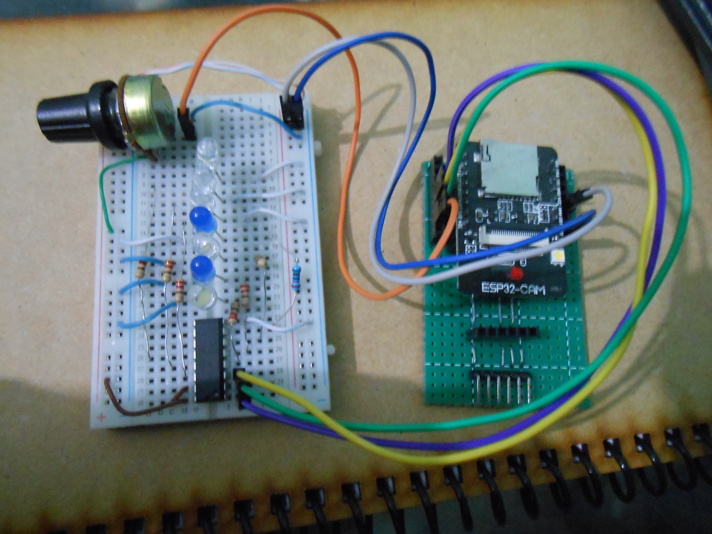
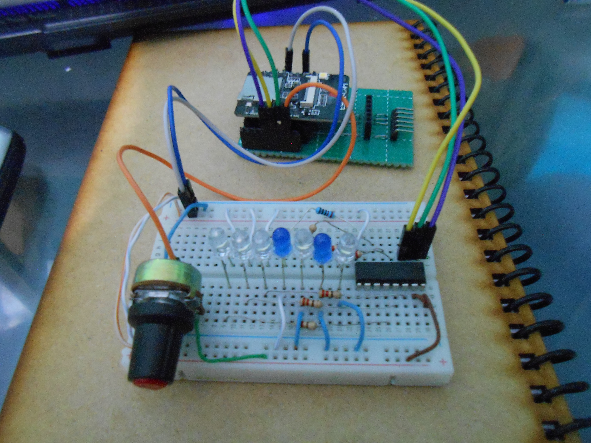
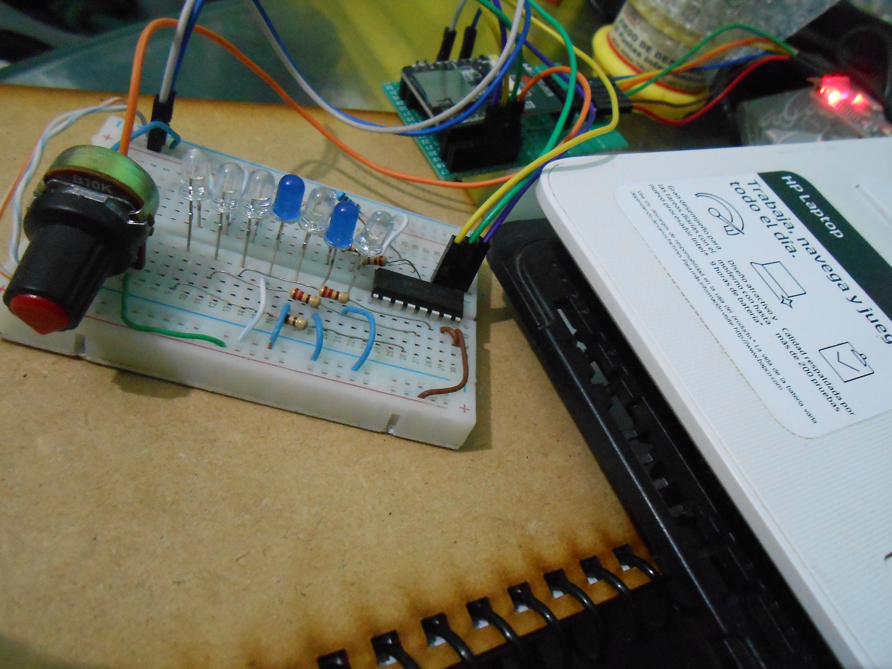
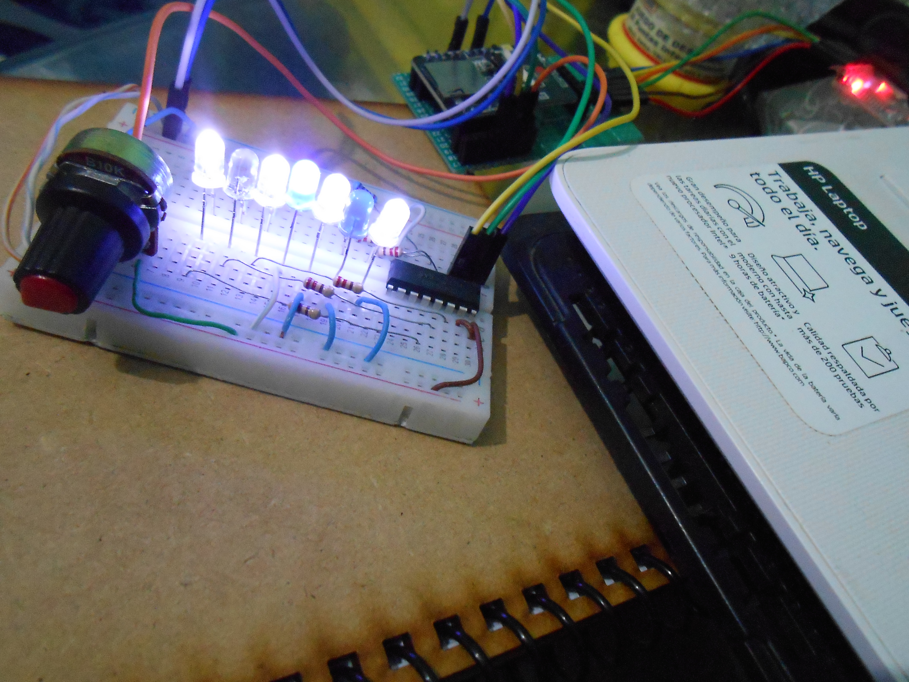
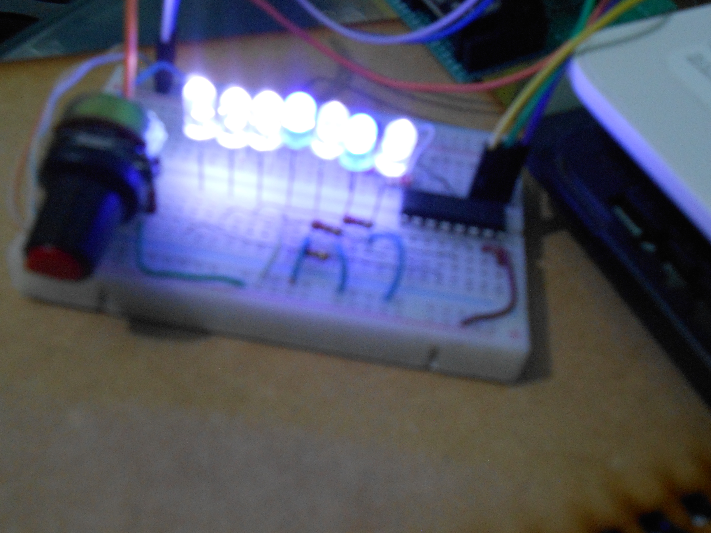
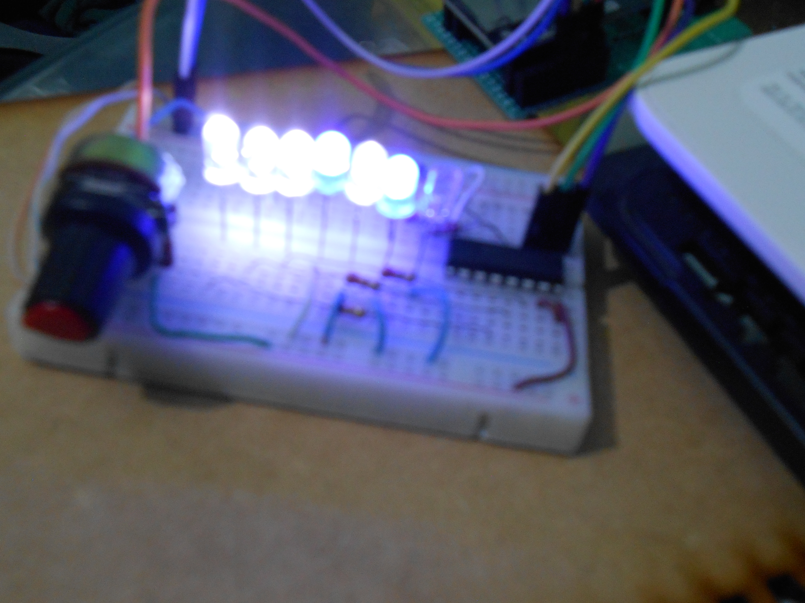

# Secuencias de LEDs usando Potenciómetro & CD4094

## Materiales utilizados en la práctica:

1. Potenciómetro de 10 K.
2. 7 Resistencias de 220 OHMS.
3. 7 LEDs.
4. ESP32-CAM.
5. Registro de Desplazamiento de 8 bits CD4094.
6. Convertidor de USB a TTL.

## Procedimiento

1. Lo primero que se hace es analizar el CD4094, la información necesaria está en [este documento](./assets/CD4094.pdf)
2. Con ayuda de la siguiente tabla se realizarón unas operaciones para simplificar y facilitar la programación. Se ven las secuencias que tienen los LEDs, las 'S' corresponden a los LEDs, las 'Q' corresponden a las salidas del CD4094 ('Q8' no es utilizado por el momento). Los Binarios resultantes se convierten a decimales.

4. Según el rango de valor que tenga el potenciómetro cambiará la secuencia.
5. En la placa ESP32-CAM se trabajará con los pines GPIO2 (Potenciómetro), GPIO14 (Pin de DATA), GPIO15 (Pin de CLOCK) y GPIO13 (Pin de STROBE).

## Resultados:
### Secuencia 0:

### Secuencia 1:

### Secuencia 2 & 5:

### Secuencia 3:

### Secuencia 4:

## Información de ayuda:
[Blog donde enseñan sobre el comando shiftOut](http://manueldelgadocrespo.blogspot.com/p/shiftout_1.html)

[Vídeo donde explican sobre el CD4094 en un Arduino R3 Uno](https://www.youtube.com/watch?v=fOIQCieTDEc)

